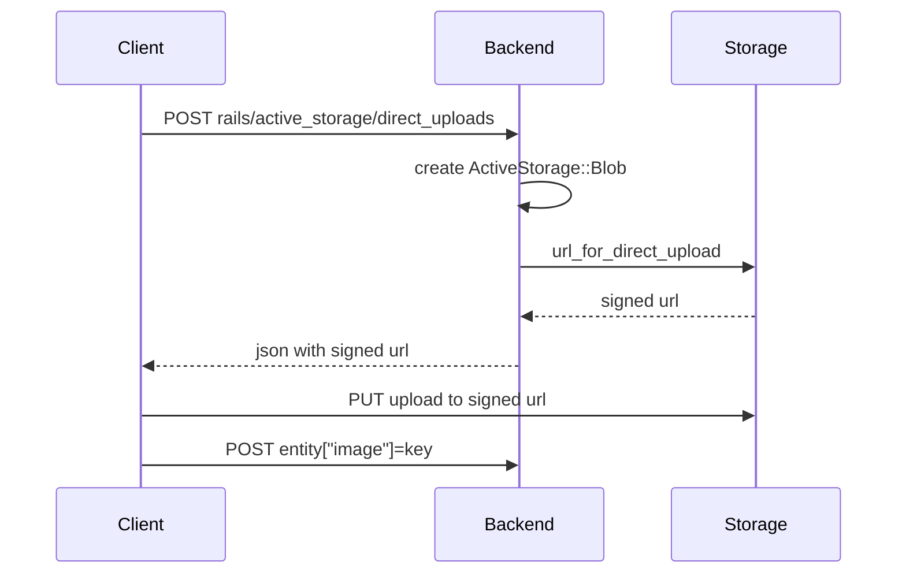

# README

Know issue:

* https://github.com/rails/rails/issues/38940
* https://github.com/rails/rails/issues/43971
* https://rubyonrails.org/2022/2/11/this-week-in-rails-rails-7-0-2-schema-versioning-based-on-the-rails-version-and-more-cbcb0592
